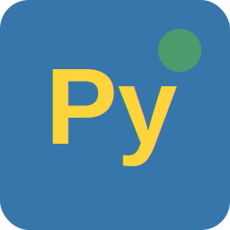
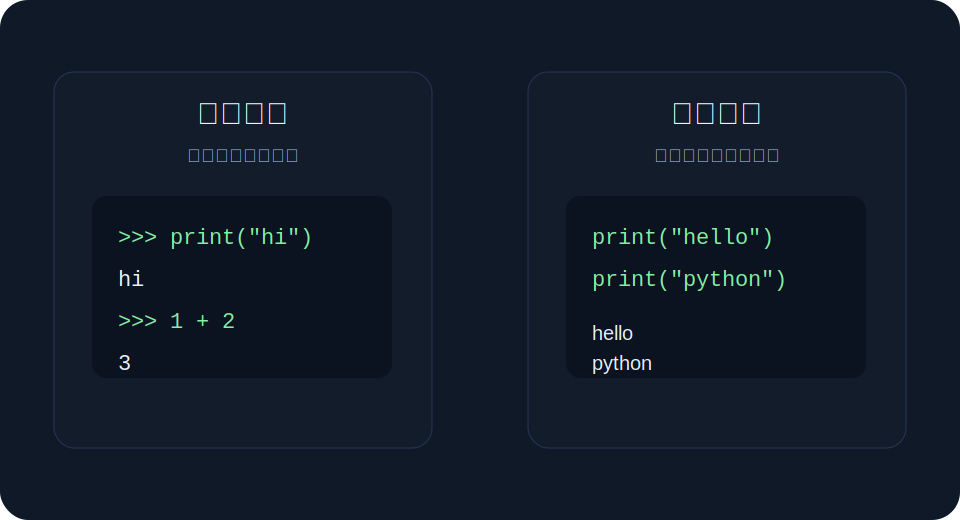

<div align="center">
  
  <h1>Start Your Python</h1>
  <p>面向 Python 初学者的本地学习工作区，把中文课程、示例代码和真实终端运行放在一个 PyCharm 风格界面里。</p>

  <p>
    <a href="https://github.com/sunnyhmz7010/start-your-python/releases"></a>
    <a href="LICENSE"></a>
    <a href="https://github.com/sunnyhmz7010/start-your-python/actions/workflows/ci.yaml"></a>
  </p>

  <p>
    <a href="https://github.com/sunnyhmz7010/start-your-python/releases">下载版本</a>
    ·
    <a href="content/lessons">查看课程</a>
    ·
    <a href="SECURITY.md">安全反馈</a>
  </p>
</div>

## 为什么做它

Python 入门最容易卡在“看懂教程”和“真的跑起来”之间。Start Your Python 用接近桌面 IDE 的工作区组织课程，让初学者在同一个界面里阅读中文步骤、查看 `.py` 课程文件、运行示例代码，并在终端里看到标准输出、错误输出和 `input()` 交互。

它不是通用 IDE，也不捆绑 Python 解释器；它专注于把本机 Python 学习流程做得清楚、稳定、可继续。

## 预览

<div align="center">
  
</div>

## 核心能力

### 学习工作区

- PyCharm 风格布局：课程树、编辑区、步骤内容和底部工具窗口
- 中文章节目录直接来自 `content/lessons/` 下的真实 `.py` 文件
- 编辑态用于查看课程源码，学习态用于按步骤阅读讲解和示例

### 真实运行

- 桌面端课程代码块可调用本机 Python 解释器运行
- 底部 Terminal 支持 stdout、stderr 和 `input()` 输入
- 未检测到 Python 时，可跳转到安装课程并重新检测

### 本地学习

- 学习进度保存在本机设备
- 支持最近学习状态，重新打开后继续进入课程
- Android 构建提供课程阅读体验，适合移动端复习

## 快速开始

从 [Releases](https://github.com/sunnyhmz7010/start-your-python/releases) 下载 Windows 便携包 `StartYourPython-vX.Y.Z-win-x64.zip`。解压后直接运行根目录里的 `Start Your Python.exe`，压缩包根目录同时包含课程文件目录 `content/`。

桌面端运行课程代码前，请先确认系统已安装 Python：

```bash
python --version
```

Windows 也可以使用：

```bash
py -3 --version
```

## 课程内容

课程使用 `.py` 文件承载注解、讲解和示例代码，应用会读取这些文件生成课程树和步骤内容。

```text
content/lessons/
├─ 第一章 Python环境准备/
│  ├─ Python是什么.py
│  ├─ 安装Python.py
│  ├─ 配置开发环境.py
│  └─ 第一次运行Python.py
├─ 第二章 基础语法入门/
│  ├─ Hello World.py
│  ├─ 注释与缩进.py
│  ├─ 输入与输出.py
│  └─ 常见语法错误.py
...
```

课程图片放在 `public/course-images/`，可在课程 Markdown 中用 `/course-images/name.svg` 引用。

## 本地开发

安装依赖：

```bash
npm install
```

启动 Web 开发服务：

```bash
npm run dev
```

运行桌面开发版：

```bash
npm run tauri:dev
```

运行质量检查：

```bash
npm run typecheck
npm run test
npm run build
```

构建桌面应用：

```bash
npm run tauri:build
```

构建移动 Web 资源并同步 Android：

```bash
npm run build:mobile
npm run android:sync
```

## 技术栈

- Vue 3 + Vite
- Pinia
- Tauri 2
- Capacitor
- Vitest
- TypeScript

## 安全反馈

如果发现安全问题，请不要公开提交可利用细节。请按 [Security Policy](SECURITY.md) 私下反馈。

## 许可证

[MIT](LICENSE)
